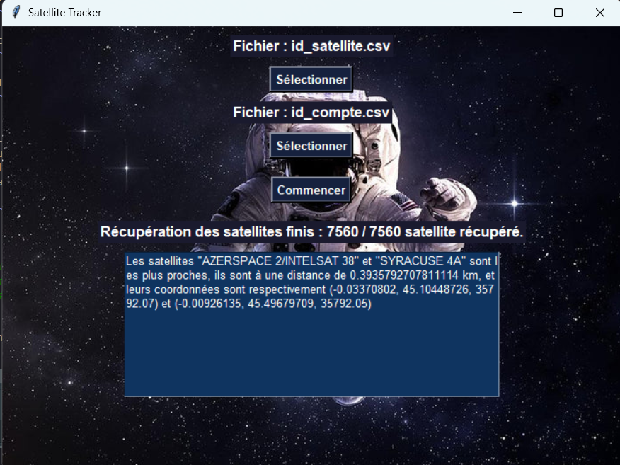

# SpaceWatchers — comparaison de positions de satellites

Projet réalisé à deux en terminale NSI avec Victor Laurini. SpaceWatchers récupère des positions de satellites auprès de l’API N2YO, recherche une paire proche dans les données reçues et affiche le résultat dans une interface Tkinter.

Le projet a reçu le Prix Coup de cœur académique et la deuxième place nationale aux Trophées NSI 2025.



## Fonctionnement

1. L’utilisateur choisit un CSV de satellites et un fichier local contenant une clé N2YO.
2. Le programme lit les identifiants NORAD et récupère les positions par lots.
3. La recherche sépare les positions en deux groupes, analyse chaque groupe puis compare les points proches de la séparation.
4. L’interface affiche la paire retenue et ses coordonnées.

Les requêtes réseau sont exécutées avec `ThreadPoolExecutor`. La récupération est ponctuelle : l’application n’assure pas de suivi en temps réel.

## Ma contribution

J’ai réalisé la lecture des fichiers CSV, l’extraction des identifiants NORAD et la recherche récursive de proximité. L’interface graphique a été intégrée au travail du binôme.

## Lancer le projet

Prérequis : Python avec Tkinter, une connexion Internet et une clé personnelle [N2YO](https://www.n2yo.com/api/).

```powershell
git clone https://github.com/RaphaelCordelle/SpaceWatchers.git
cd SpaceWatchers
python -m venv .venv
.\.venv\Scripts\python.exe -m pip install -r requirements.txt
.\.venv\Scripts\python.exe main.py
```

Dans l’application, sélectionner :

- [`examples/satellites.example.csv`](examples/satellites.example.csv), ou un CSV avec une colonne `NORAD Number` ;
- une copie locale de [`examples/compte.example.csv`](examples/compte.example.csv) contenant la clé dans la colonne `api id`.

Les fichiers utilisent le point-virgule comme séparateur. Les exemples publiés ne contiennent aucune clé réelle.

Les coordonnées de l’observateur sont lues dans `N2YO_OBSERVER_LATITUDE`, `N2YO_OBSERVER_LONGITUDE` et `N2YO_OBSERVER_ALTITUDE`. Elles valent `0` par défaut et ne sont pas enregistrées dans le dépôt.

## Périmètre du calcul

Le programme d’origine compare directement latitude, longitude et altitude sans les convertir dans un même repère. La valeur affichée n’est donc pas une distance physique fiable en kilomètres. SpaceWatchers n’est pas un outil de prévision des collisions.

## Technologies

- Python ;
- Tkinter ;
- Requests et API N2YO ;
- `ThreadPoolExecutor` ;
- CSV et JSON.

Les précautions concernant les clés sont regroupées dans [`SECURITY.md`](SECURITY.md). La répartition du travail est indiquée dans [`AUTHORS.md`](AUTHORS.md).

Licence : GNU GPL v3 ou ultérieure.
